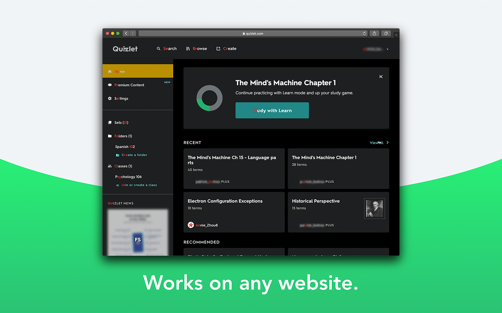
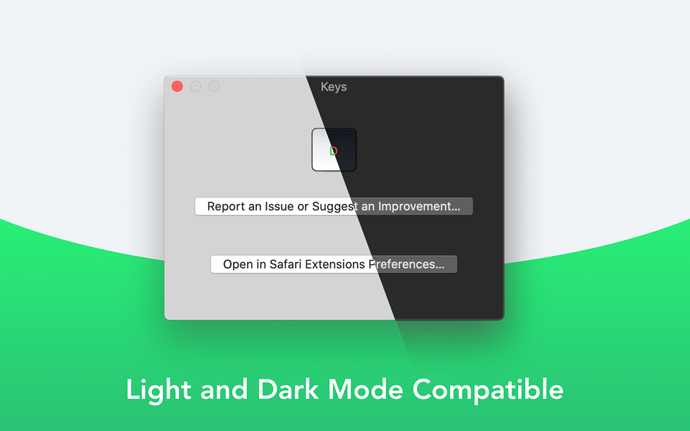
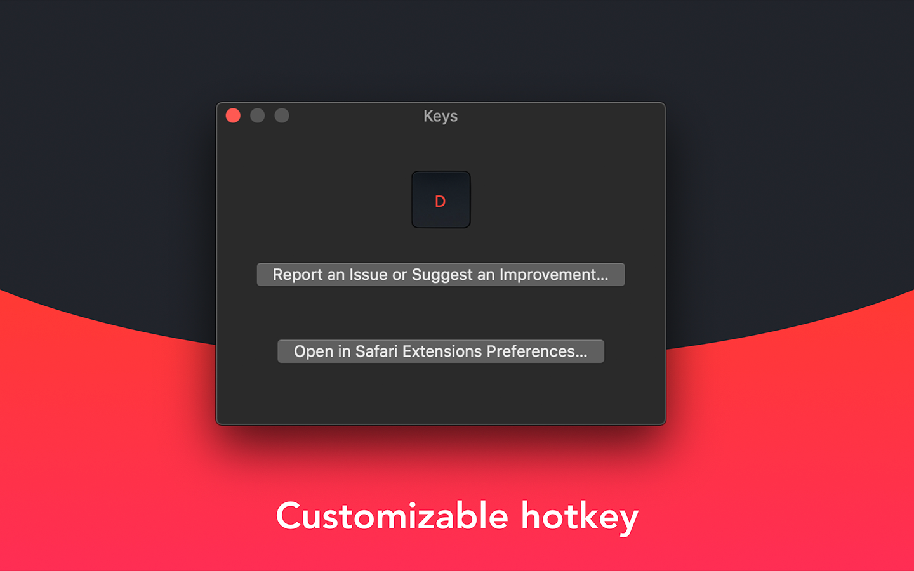

<h1 align="center">
  
    Keys for Safari 
  
  
</h1>
Keys for Safari <b>free</b> is a browser extension that lets users <b>keyboard-navigate</b> the web by dynamically generating and rendering shortcut keys in the least ugly/confusing way possible.

## Demo

  

## Features
<table style="width:100%">
  <tr>
    <td>
      
    </td>
    <td>
      
    </td>
  </tr>
  <tr>
    <td>
      
    </td>
    <td>
      
    </td>
  </tr>
</table>
