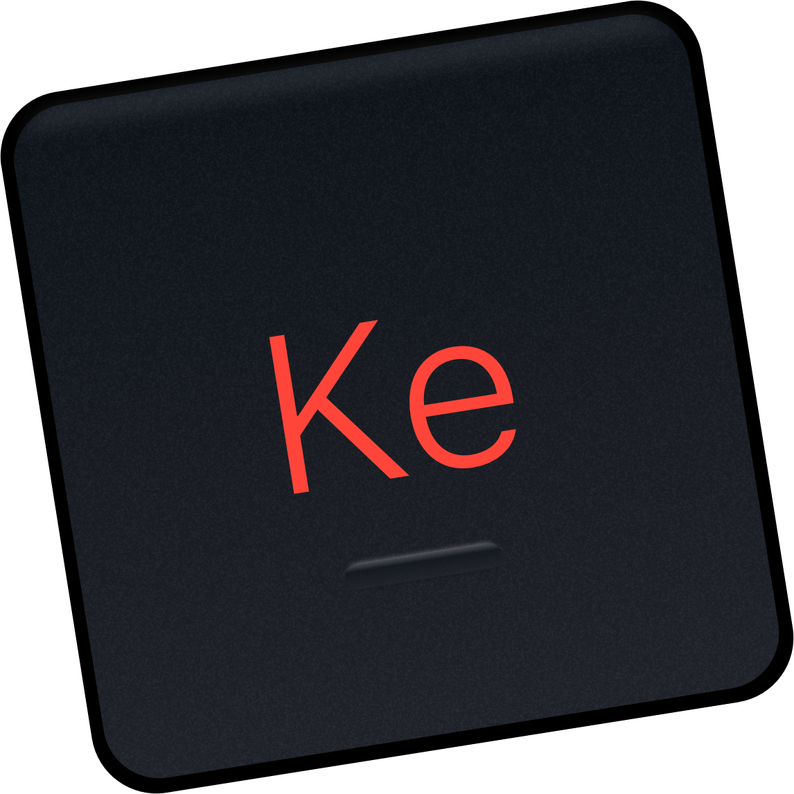

<h1 align="center">
  
    Keys for Safari 
  
  
</h1>
An accessibility tool that doesn't look like an accessibility tool, Keys for Safari is a browser extension that lets users <b>keyboard-navigate</b> the web by dynamically generating and rendering shortcut keys in the least ugly/confusing way possible. 
 
If you have a motor disability or other accessibility issue, please email keys4safari@gmail.com for 100% off this extension. No questions asked.

All proceeds are donated to the Durham Nursing and Rehabilitation Center, a grossly underfunded public nursing home in Durham, North Carolina.

 

